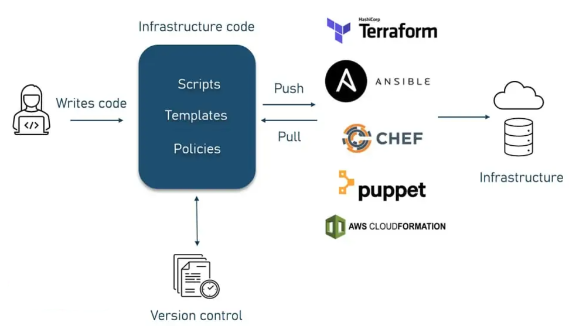

# **Provisioning Cloud Resources**
When setting up and managing cloud infrastructure, there are three primary approaches to
provisioning resources:
1. **GUI (Graphical User Interface)**
   * Use cloud provider web consoles (like the AWS Management Console or Azure Portal) to manually create, configure, and manage resources.
   * **Pros:** Easy for beginners; provides a visual interface.
     * **Cons:** Time-consuming and prone to human errors; not scalable or suitable for repetitive tasks.

2. **API/CLI (Command Line Interface)**
   * Directly interact with cloud services using APIs or command-line tools. Examples include AWS CLI or Azure CLI.
   * **Pros:** Faster than GUI, supports automation through scripts.
   * **Cons:** Requires familiarity with the CLI commands and scripting; less organized than IaC.

3. **IaC (Infrastructure as Code)**
   * Use tools like Terraform or AWS CloudFormation to define and manage cloud resources through code.
   * **Pros:** Ensures consistency, allows version control, and supports reusable configurations for scalable environments.
   * **Cons:** Requires learning the IaC tool and syntax.

Each approach suits different needs, but IaC is the preferred method for modern, scalable, and automated cloud deployments. Tools like Terraform simplify infrastructure management by
codifying resource definitions into declarative templates, reducing manual effort and enhancing
reliability.

# **What is Infrastructure as Code (IaC)**?
IaC is an approach that enables the management and provisioning of IT infrastructure using code, replacing manual processes with automated scripts.

## **Approaches to IaC**
There are two main approaches to IaC:
1. Declarative Approach
   * Definition: A declarative approach defines the desired state of the system, including what resources you need and any properties they should have, and an IaC tool will configure it for you. A declarative approach also keeps a list of the current state of your system objects, which makes taking down the infrastructure simpler to manage.Focuses on what needs to be done, not how to do it.
   * Commonly used in tools like Terraform and Kubernetes.
2. Imperative Approach
   * Definition: An imperative approach instead defines the specific commands needed to achieve the desired configuration, and those commands then need to be executed in the correct order.

## **Benefits of IaC**
1. **Cost Reduction:** Automation reduces manual labor and operational overhead.
2. **Faster Deployments:** Streamlines resource provisioning, cutting down deployment time.
3. **Error Reduction:** Minimizes human errors through consistent configurations.
4. **Consistency:** Ensures environments (e.g., dev, test, prod) are identical.
5. **Eliminates Configuration Drift:** Prevents discrepancies between infrastructure states across environments by enforcing uniform code definitions.

## **Tools Supporting IaC**
* Terraform
* AWS CloudFormation
* Ansible
* Pulumi
* Chef
* SaltStack

## **AWS CloudFormation vs. Pulumi vs. Terraform**
### **AWS CloudFormation:**

* **Cloud-Only:** AWS-specific tool, integrates deeply with AWS services.
* **Declarative Syntax:** Uses YAML/JSON for defining resources.
* **Limitations:** AWS-only and can be complex for large infrastructures.

**Why Terraform:** Terraform supports multi-cloud environments (AWS, Azure, Google Cloud), and its HCL syntax is simpler and more user-friendly than CloudFormation’s YAML/JSON.

### **Pulumi:**

* **Programming Language-Based:** Uses TypeScript, Python, Go, or C# for infrastructure definition.
* **Multi-Cloud Support:** Supports multiple cloud providers.
* **Flexibility:** Great for developers, offering complex logic, but with a steeper learning curve.

**Why Terraform:** Terraform’s declarative approach (HCL) is easier for teams without programming expertise, and it has a more mature ecosystem and broader community.

## **Why Terraform is Often Preferred:**
* **Multi-cloud Support:** Terraform works seamlessly with multiple cloud providers, offering a unified approach to managing infrastructure, regardless of whether it’s on AWS, Azure, Google Cloud, or others.
* **Declarative Syntax:** Terraform uses HashiCorp Configuration Language (HCL), which is concise, readable, and designed specifically for infrastructure configuration. This makes it easier to understand and maintain over time.
* **State Management:** Terraform provides strong state management, allowing teams to track the current state of infrastructure, making it easier to manage and update resources.
* **Modularity:** Terraform supports reusable modules, enabling users to define reusable infrastructure components and configurations, which promotes consistency and best practices.
* **Strong Ecosystem:** Terraform has a large, active community, extensive documentation, and numerous providers and integrations that support various infrastructure services and third-party tools.