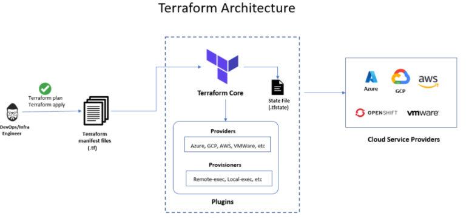

# **Terraform**
Terraform is a robust Infrastructure as Code (IaC) tool developed by HashiCorp. It enables
developers and IT teams to define, provision, and manage cloud and on-premises
infrastructure efficiently. Terraform provides a declarative language for defining resources,
supports versioning, and ensures infrastructure consistency across various environments.

## **Key Features of Terraform:**
1. Multi-cloud Support: Works across major cloud providers like AWS, Azure, and Google Cloud, as well as on-premises systems.
2. State Management: Maintains a record of infrastructure state to track changes over time.
3. Resource Dependencies: Automatically determines resource dependencies and executes changes in the correct order.
4. Extensibility: Uses providers to manage various types of services and platforms.

## **Terraform Workflow:**
The core Terraform workflow consists of three stages:
1. Write
    * Define the desired infrastructure using HashiCorp Configuration Language (HCL).
    * Configurations can span across multiple cloud providers or services.
    * Example: Define virtual machines, Virtual Private Cloud (VPC), security groups, and load balancers in a single file.

2. Plan
    * Terraform generates an execution plan based on your configuration and current infrastructure state.
    * The plan describes what will be created, updated, or destroyed to match the desired state.
    * This step ensures you can review and confirm the changes before they are applied.

3. Apply
    * Terraform executes the changes in the planned order.
    * It respects dependencies between resources, ensuring actions like recreating a VPC occur before scaling virtual machines in that VPC.
    * Once completed, Terraform updates the state file to reflect the changes.

## **Architecture of Terraform**
Terraform architecture mainly consists of the following components:
* **Terraform Core:** Handles execution plans, state management, and dependency resolution.
* **Providers:** Plugins that interact with cloud APIs to manage resources.
* **State File:** Tracks the current state of managed infrastructure for consistency.



## **Benefits of Terraform**
* **Version Control:** Infrastructure configurations can be versioned alongside application code.
* **Declarative Syntax:** Focus on the desired state without specifying procedural steps.
* **Reusable Modules:** Modularize configurations to standardize and reuse infrastructure setups.
* **Collaboration:** Teams can work together using remote state management and workspaces.
* **Scalability:** Efficiently manage infrastructure at any scale, from small projects to enterprise-level applications.

## **Terraform CLI Commands**
The Terraform CLI (Command-Line Interface) provides a set of commands to manage and interact with Terraform configurations, perform state management, and interact with cloud resources. Here's an overview of the most common Terraform CLI commands:

1. **terraform init**
   * Initializes a Terraform working directory, downloading the necessary provider plugins and initializing the backend configuration
   * ````terraform init````
2. **terraform validate**
   * Validates the syntax and configuration of your Terraform files without applying changes.
   * ````terraform validate````
3. **terraform plan**
   * Generates and shows an execution plan for your configuration, detailing what actions Terraform will take to reach the desired state
   * ````terraform plan````
4. **terraform fmt**
   * Automatically formats your Terraform configuration files to follow standard Terraform formatting conventions.
   * ````terraform fmt````
5. **terraform apply** 
   * Applies the changes defined in the Terraform configuration to your infrastructure. It can optionally accept a plan file or prompt for approval before applying the changes.
   * ````terraform apply````
6. **terraform output** 
   * Retrieves and displays the values of the outputs defined in your Terraform configuration. It can be used to query outputs after running "terraform apply".
   * ````terraform output````
7. **terraform destroy**
   * Destroys all the resources defined in your Terraform configuration, removing them from the cloud provider.
   * ````terraform destroy````

### **Note**
- The **-auto-approve** flag in Terraform is used to skip the interactive approval prompt when **applying** or **destroying** infrastructure. By default, Terraform requires manual confirmation to proceed with the terraform apply and terraform destroy commands to prevent accidental changes or deletions. The -auto-approve flag automates this step, allowing the command to execute immediately.
  - ```terrafrom apply -auto-approve``` or  ```terrafrom destroy -auto-approve```
  - **Caution**: Using -auto-approve removes the safeguard of manual review, which can lead to unintended changes or deletions if the configuration or execution plan is not carefully reviewed beforehand. Always double-check your Terraform configuration, especially in production environments, before using this flag.